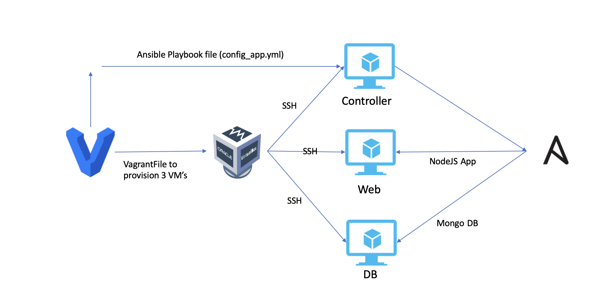

# tech230-iac

## Ansible Diagram

## How IaC benefits businesses

- Cost:

  - Helps a business save costs because building and maintaining own data centers is not required

- Boosts Productivity:

  - Improves prodcutivity of operations teams
  - Allows you to automate infrastructure hecne saves time, money and minimizes the risk of human error
  - More focus can be on mission critical tasks

- Scalability & Availability:
- Consistent Configuration:
  - Standardised conifrguartion and setup for infrastercuture deployment during cloud migration
  - Reduces human error and expediates the migration process

## Benefits of Ansible:

- It's simple, human readable automation. no coding skills needed.
- Ansible is agentless where ansible being the controller acts as master node. no agent node which means it doesn't require any software to be installed on it.
- Uses SSH protocol for connectivity with servers. i.e. SSH keys

## How Ansible works

- We can use vagrant to create 3 VM's
- Create ansible controller, deploy node js, mongodb
- Aim is to control and configure them without having to ssh in each VM. Controller will do the work.
- Ansible has python dependency (built with python)
- It uses YAML

## Ansible workflow diagram

Ansible can also be used with a hybrid approach where ansible controller is hosted locally but our app and db vm's are hosted in the cloud. Diagram to explain how workflow in ansible looks like:

## IaC workflow diagram

## Using Ansible (setup instructions)

Follow the steps in the guide [here](./ansible-setup.md) to setup Ansible and learn how to use it

## Why learn IaC & Ansible

## End goal of implementing IaC
