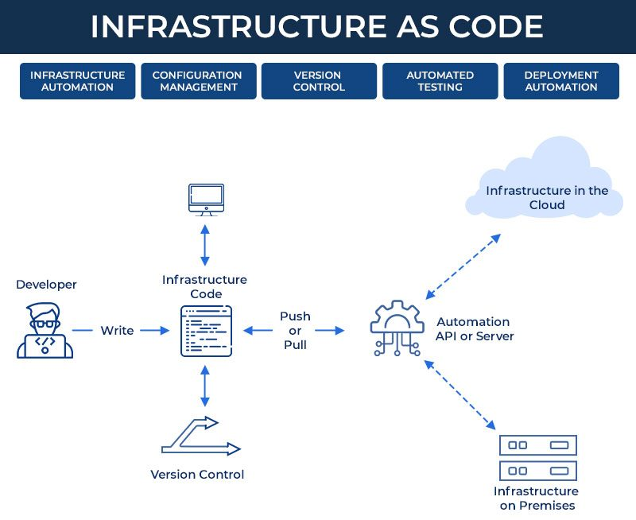

# tech230-iac

## IaC workflow diagram



## How IaC benefits businesses

- Cost:

Helps a business save costs because building and maintaiing own data centers is not required

- Scalability & Availability
- Performance visibility
- Configuration Inconsistencies

## Why learn IaC & Ansible

## End goal of implementing IaC

## Benefits of Ansible:

- It's simple, human readable automation. no coding skills needed.
- Ansible is agentless where ansible being the controller acts as master node. no agent node which means it doesn't require any software to be installed on it.
- Uses SSH protocol for connectivity with servers. i.e. SSH keys

## How Ansible works

- We can use vagrant to create 3 VM's
- Create ansible controller, deploy node js, mongodb
- Aim is to control and configure them without having to ssh in each VM. Controller will do the work.
- Ansible has python dependency (built with python)
- It uses YAML

## Ansible workflow diagram

Ansible can also be used with a hybrid approach where ansible controller is hosted locally but our app and db vm's are hosted in the cloud. Diagram to explain how workflow in ansible looks like:


## Using Ansible (setup instructions)

1. Make sure Vagarntfile exists in the root folder of your repo.
2. Run `vagrant up`
3. Run `vagrant status` (should see 3 vm's running)

vagrant ssh controller
ssh vagrant@192.168.33.10
password: vagrant

vagrant@web:~$
sudo apt update -y
exit

ssh vagrant@192.168.33.11
password: vagrant

vagrant@db:~$
sudo apt update -y
exit

ansible --version
output: command not found

ansible folder structure: default
cd /etc/ansible/hosts and ansible.conf

hosts is to store the addresses of any hosts/agents

To install ansible:

```
sudo apt install software-properties-common
sudo apt-add-repository ppa:ansible/ansible
sudo apt-get update -y
sudo apt-get install ansible -y
```

ansible --version
cd etc
cd ansible
ls

sudo ansible all -m ping
sudo nano hosts

add:
[web]
192.168.33.10 ansible_connection=ssh ansible_ssh_user=vagrant ansible_ssh_pass=vagrant

sudo ansible web -m

run update and upgrade
exit

vagrant ssh web - repeat update & upgrade
exit

vagrant ssh db - repeat update & upgrade
