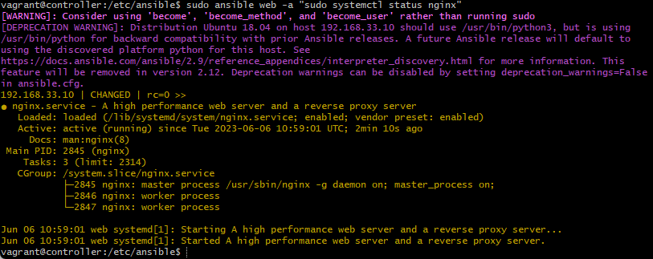

# Ansible Playbooks

## Ansible Playbook Attributes

- `name`: Description for the task
- `become user`: For privilige escalation
- `apt`: Manages pacakges
- `update_cache`: Does not update cache, equivalent of apt-get update before the operation
- `state`: Indicates desired package state
- `shell`: To execute a shell command
- `args`: To pass additional parameters
- `chdir`: Change into this directory before running the command
- `gather_facts`: To gather facts about remote hosts i.e. app,db
- `synchronize`: wrapper around rsync to make common tasks in playbook quick

NOTE: rsync is a command line tool for copying files and directories between local and remote systems.

## Nginx Playbook

We can create Ansible Playbooks to codify steps to install/setup (using yaml) webserver called nginx in the web node.

1. To make sure you're in the right directory run `cd /etc/ansible`

2. Run `sudo nano config_nginx_web.yml` to create a playbook to install nginx in web-server or any other servers.

NOTE: make sure to add --- to start our yaml file. this is how intepretor knows when our yaml code starts in the file.

3. Setup your file as follows:

```
# add the name of the host in the file (dash below starts a code block)

- hosts: web

# gather facts
  gather_facts: yes

# to add admin access in this file:
  become: true

# add instructions/tasks to install nginx:

  tasks:

  - name: Installing Nginx
    apt: pkg=nginx state=present
```

4. Save and run the file using `sudo ansible-playbook config_nginx_web.yml`

output:


5. We can now check nginx status to see if nginx is active and running:

`sudo ansible web -a "sudo systemctl status nginx"`



### Above steps can be repeated for `db`

your final output for db should be:


## NodeJS Playbook

This playbook is created to copy app folder to web, install NodeJS and start the application.

NOTE: we can use the following command to copy app folder to our web agent. However for the purpose of the exercise we will be creating a playbook to accomplish this

`ansible web -m copy -a "src=/etc/ansible/app dest=/home/vagrant"`

1. Creating the playbook:

```
sudo nano config_app.yml
```

2. Adding tasks to the playbook:

We can add tasks to accomplish following tasks in this playbook:

- Install Nginx
- Copy App folder to web
- Install NodeJS
- Start the Application
- Add reverse proxy (yet to be completed)

Code inside the playbook should look like this:

```
 GNU nano 2.9.3                    config_app.yml


# playbook to install nodejs

---

# setup hosts

- hosts: web

# gather facts

  gather_facts: yes

# provide admin access

  become: true
# tasks
  tasks:

  - name: Installing Nginx
    apt:
      pkg: nginx
      state: present
  - name: Copy app folder to web
    synchronize:
      src: /home/vagrant/app
      dest: /home/vagrant

  - name: NodeJs Repo
    shell: curl -sL https://deb.nodesource.com/setup_12.x | sudo -E bash -
    args:
      warn: no

  - name: Installing Nodejs
    apt:
      name: nodejs
      update_cache : yes
      state: present

  - name: Installing npm packages
    command:
      cmd: npm install
      chdir: /home/vagrant/app
    become_user: vagrant

  - name: Nginx reverse proxy
    replace:
      path: /etc/nginx/sites-available/default
      regexp: 'try_files \$uri \$uri/ =404;'
      replace: 'proxy_pass http://localhost:3000/;'

  - name: Nginx restart
    systemd:
      name: nginx
      state: reloaded

  - name: Kill node process
    shell: killall node
    args:
      chdir: /home/vagrant/app

  - name: Start Application
    shell: npm start
    args:
      chdir: /home/vagrant/app


```


3. Execute playbook with `sudo ansible-playbook app-config.yml`


4. Copy the web IP and paste in the browser with `port 3000` at the end

Working App:


## DB Playbook

We want to make sure ping is still active with status 200, in order to check this for web and db, run:

```
sudo ansible all -m ping
```

Now we will create a playbook to accomplish the following: 

- setup mongodb in db-server
- change mongo.conf to facilitate required connections
- end goal to cnnect app to db & see the /posts in the browser

NOTE: If any playbook return error run it with `-vvv` at the end to get readable error.

1. To create a playbook
```
cd /etc/ansible
sudo nano setup_mongo.yml
```

Code within the playbook:

```
  GNU nano 2.9.3                   setup_mongo.yml

# to install required version of mongodb in db-server

---
# hosts name

- hosts: db

# gather facts/logs

  gather_facts: yes

# admin access

  become: true

# add instrcutions

  tasks:
  - name: Setting up MongoDB
    apt: pkg=mongodb state=present
# status check - ensure app is running


# change bindip
  - name: Changing bindip
    replace:
      path: /etc/mongodb.conf
      regexp: 'bind_ip = 127.0.0.1'
      replace: 'bind_ip = 0.0.0.0'

  - name: Uncomment port
    replace:
      path: /etc/mongodb.conf
      regexp: '# port = 27017'
      replace: 'port = 27017'

# Restart mongodb
  - name: MongoDB restart
    systemd:
      name: mongodb


```

2. To run the playbook:

```
sudo ansible-playbook setup_mongo.yml
```

output:


3. To check the status of mongodb

```
sudo ansible db -a "sudo systemctl status mongodb"
```

4. To manually change the bindip:

SSH into db:
```
ssh vagrant@192.168.33.11
cd /etc
sudo nano mongod.conf
```

change following two lines as follows:

bind_ip = 0.0.0.0
port = 27017

5. To make sure our conifguration kicks in we re run mongodb

```
sudo systemctl restart mongodb
sudo systemctl enable mongodb
sudo systemctl status mongodb
```

6. Exit back into controller, `ssh into web` and create a db host following below steps:
```
export DB_HOST=192.168.33.11:27017/posts
printenv DB_HOST
.bashrc
cd /home/vagrant/app
npm start
```


