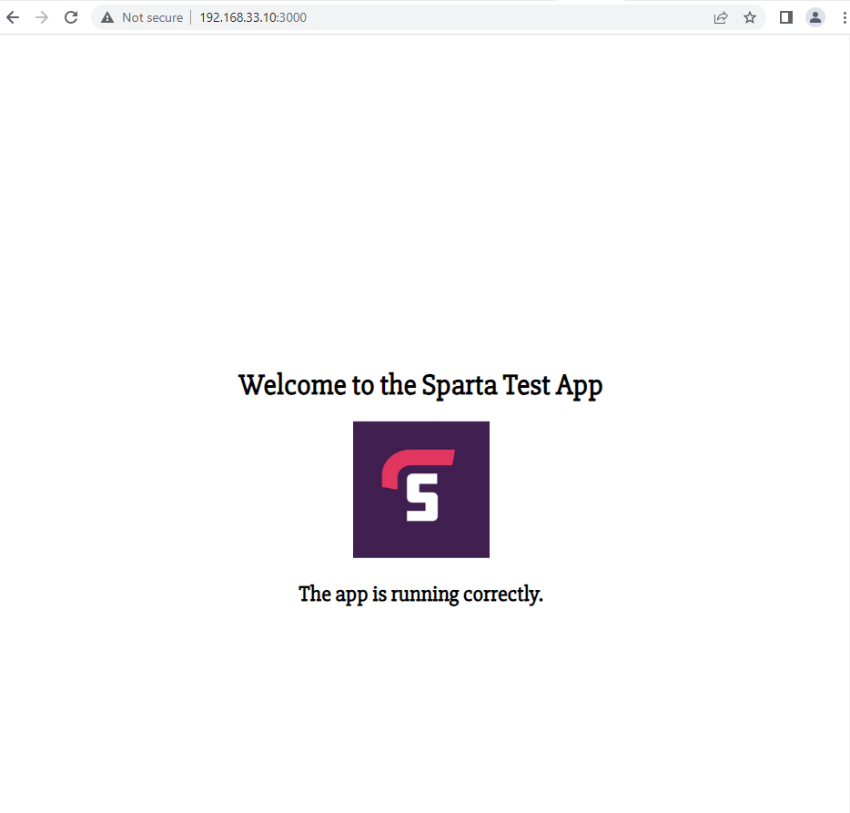

# Ansible Playbooks


## Ansible Playbook Attributes

- `name`: Description for the task
- `become user`: For privilige escalation
- `apt`: Manages pacakges
- `update_cache`: Does not update cache, equivalent of apt-get update before the operation
- `state`: Indicates desired package state
- `shell`: To execute a shell command
- `args`: To pass additional parameters
- `chdir`: Change into this directory before running the command
- `synchronize`: wrapper around rsync to make common tasks in playbook quick

NOTE: rsync is a command line tool for copying files and directories between local and remote systems.

## Nginx Playbook

We can create Ansible Playbooks to codify steps to install/setup (using yaml) webserver called nginx in the web node.

1. To make sure you're in the right directory run `cd /etc/ansible`

2. Run `sudo nano config_nginx_web.yml` to create a playbook to install nginx in web-server or any other servers.

NOTE: make sure to add --- to start our yaml file. this is how intepretor knows when our yaml code starts in the file.

3. Setup your file as follows:

```
# add the name of the host in the file (dash below starts a code block)

- hosts: web

# gather facts
  gather_facts: yes

# to add admin access in this file:
  become: true

# add instructions/tasks to install nginx:

  tasks:

  - name: Installing Nginx
    apt: pkg=nginx state=present
```

4. Save and run the file using `sudo ansible-playbook config_nginx_web.yml`

output:


5. We can now check nginx status to see if nginx is active and running:

`sudo ansible web -a "sudo systemctl status nginx"`


### Above steps can be repeated for `db`

your final output for db should be:


## NodeJS Playbook

This playbook is created to copy app folder to web, install NodeJS and start the application.

NOTE: we can use the following command to copy app folder to our web agent. However for the purpose of the exercise we will be creating a playbook to accomplish this


`ansible web -m copy -a "src=/etc/ansible/app dest=/home/vagrant"`


1. Creating the playbook:

```
sudo nano config_app.yml
```

2. Adding tasks to the playbook:

We can add tasks to accomplish following tasks in this playbook:

  - Install Nginx
  - Copy App folder to web
  - Install NodeJS
  - Start the Application
  - Add reverse proxy (yet to be completed)

Code inside the playbook should look like this:


3. Execute playbook with `sudo ansible-playbook app-config.yml`


4. Copy the web IP and paste in the browser with `port 3000` at the end

Working App:




