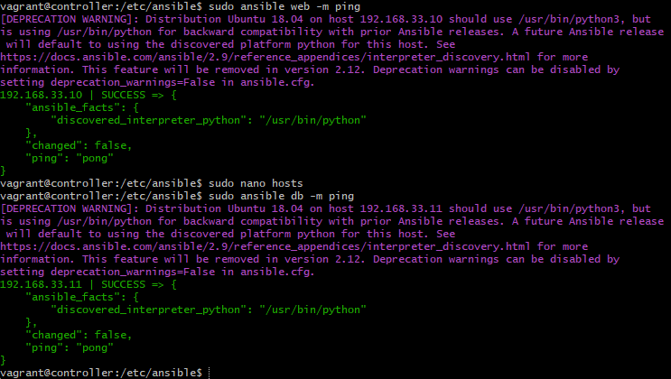

## Using Ansible (setup instructions)

Follow the steps in this guide to setup Ansible and learn how to use it

1. Make sure Vagarntfile exists in the root folder of your repo.
2. Run `vagrant up`
3. Run `vagrant status` (should see 3 vm's running)
4. Once you have all 3 VM's running, ssh into Ansible Controller using `vagrant ssh controller`
5. Run `sudo apt update -y` to install relevant updates
6. Connect to the `web` VM using IP as specified in Vagrant file, Run `ssh vagrant@192.168.33.10`
7. Enter password: `vagrant`
8. You should see your bash user change to `vagrant@web:~$`
9. Update packages in the web machine by running `sudo apt update -y` and run `exit` to logout.
10. Connect to the `db` VM using IP as specified in Vagrant file, Run `ssh vagrant@192.168.33.11`
11. Enter password: `vagrant`
12. You should see your bash user change to `vagrant@db:~$`
13. Update packages in the web machine by running `sudo apt update -y` and run `exit` to logout.
14. Now to install Ansible, run the following commands:

```
sudo apt install software-properties-common
sudo apt-add-repository ppa:ansible/ansible
sudo apt-get update -y
sudo apt-get install ansible -y
```
15. Check ansible has installed by running `ansible --version`
16. cd /etc/ansible and run `sudo nano hosts` to store addressed of our web and db hosts, You can do this by adding the following to the file:

For Web:
```
[web]
192.168.33.10 ansible_connection=ssh ansible_ssh_user=vagrant ansible_ssh_pass=vagrant
```

For db:
```
[db]
192.168.33.11 ansible_connection=ssh ansible_ssh_user=vagrant ansible_ssh_pass=vagrant
```

17. To check if your setup is correct upto this stage, run these two commands and your output should be similar to the screen below.

```
sudo ansible web -m ping
sudo ansible db -m ping
```

Output:

