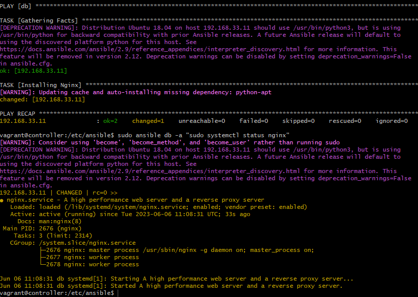

## Using Ansible (setup instructions)

Follow the steps in this guide to setup Ansible and learn how to use it

1. Make sure Vagarntfile exists in the root folder of your repo.
2. Run `vagrant up`
3. Run `vagrant status` (should see 3 vm's running)
4. Once you have all 3 VM's running, ssh into Ansible Controller using `vagrant ssh controller`
5. Run `sudo apt update -y` to install relevant updates
6. Connect to the `web` VM using IP as specified in Vagrant file, Run `ssh vagrant@192.168.33.10`
7. Enter password: `vagrant`
8. You should see your bash user change to `vagrant@web:~$`
9. Update packages in the web machine by running `sudo apt update -y` and run `exit` to logout.
10. Connect to the `db` VM using IP as specified in Vagrant file, Run `ssh vagrant@192.168.33.11`
11. Enter password: `vagrant`
12. You should see your bash user change to `vagrant@db:~$`
13. Update packages in the web machine by running `sudo apt update -y` and run `exit` to logout.
14. Now to install Ansible, run the following commands:

```
sudo apt install software-properties-common
sudo apt-add-repository ppa:ansible/ansible
sudo apt-get update -y
sudo apt-get install ansible -y
```
15. Check ansible has installed by running `ansible --version`
16. cd /etc/ansible and run `sudo nano hosts` to store addressed of our web and db hosts, You can do this by adding the following to the file:

For Web:
```
[web]
192.168.33.10 ansible_connection=ssh ansible_ssh_user=vagrant ansible_ssh_pass=vagrant
```

For db:
```
[db]
192.168.33.11 ansible_connection=ssh ansible_ssh_user=vagrant ansible_ssh_pass=vagrant
```

17. To check if your setup is correct upto this stage, run these two commands and your output should be similar to the screen below.

```
sudo ansible web -m ping
sudo ansible db -m ping
```

Output:


if we dont know operating system we would run yum command to update

run uname -a gives you info about controller

we need to use adhoc command to find out os of agent node:

sudo ansible web -a "uname -a". command checks fro access first but since we have that setup already it will move on to the argument in our command

output:


sudo ansible all 

In /etc/ansible sudo nano test.txt

we'll look to move this to web-node using adhoc command:

- find adhoc command to transfer the file from controller to web node:

try `ansible web -m copy -a "src=/etc/ansible/test.txt dest=/home/vagrant"`

output:


codify steps to install/setup (using yaml)
webserver called nginx in the web node

cd /etc/ansible

sudo nano config_nginx_web.yml to create a playbook to install nginx in web-server or any other servers.
make sure to add --- to start our yaml file. this is how intepretor knows when our yaml code starts in the file

add the name of the host in the file

(dash below starts a code block)
- hosts: web

optional things you can do is gather additional facts about the steps
  gather_facts: yes
we will also need to add admin access in this file:
  become: true

add instructions/tasks to install nginx:

tasks:
- name: Installing Nginx
  apt: pkg=nginx state=present


save the file
run the file `sudo ansible-playbook config_nginx_web.yml`

output:


we can now check nginx status to see if nginx is active and running

sudo ansible web -a "sudo systemctl status nginx"


repeat the above steps for `db`

your final output for db should be:



tasks to create a playbook to install nodejs:

share app folder to vagrant in controller

from controller to web only use playbook

`ansible web -m copy -a "src=/etc/ansible/app dest=/home/vagrant"`

sudo nano config_app.yml

- using a playbook setup nodejs required version
- copy required data into web server
- npm start
- the app should work on port 3000 (can reverse proxy be setup for this)


